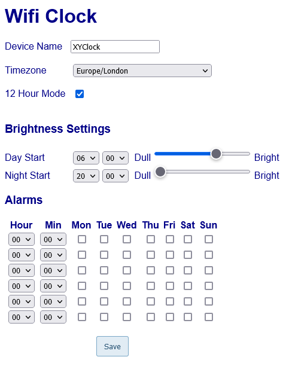
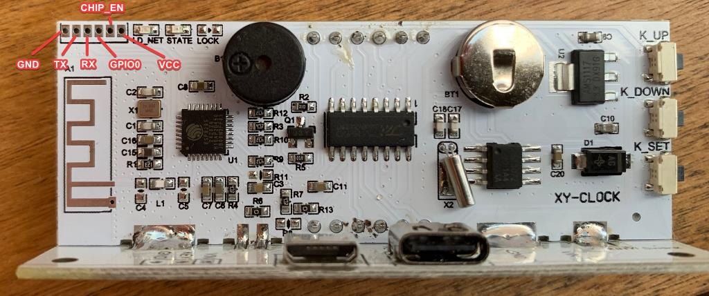
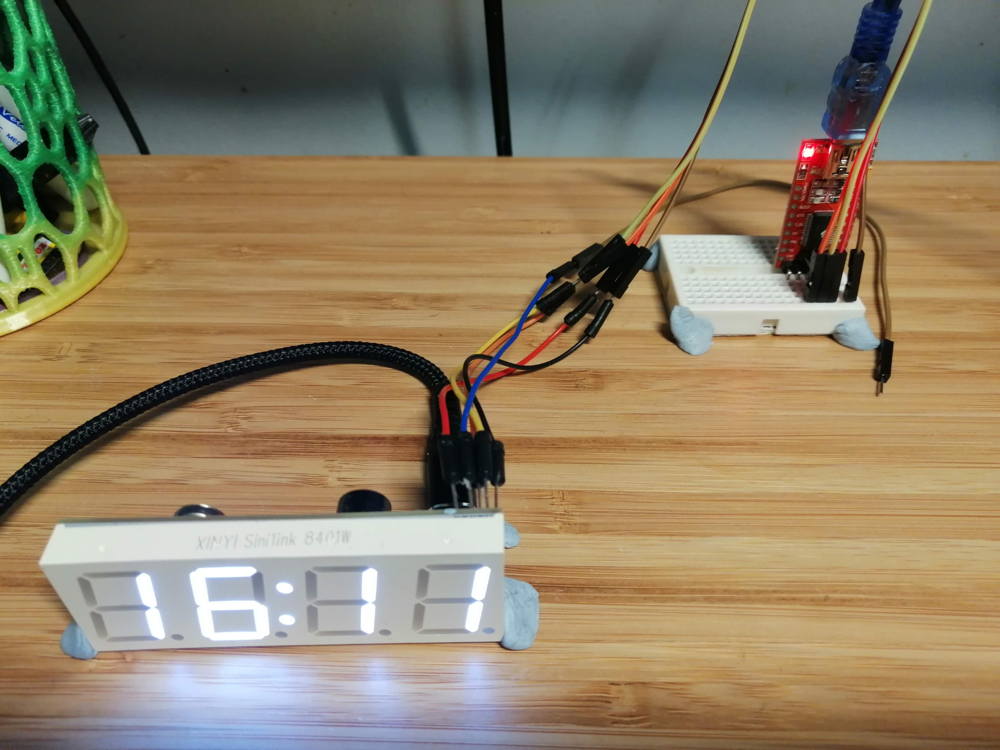

# XY Wifi Clock Replacement Firmware
This is a replacement firmware for the XY-Clock with Wifi (and similar variants) found at https://www.aliexpress.com/item/1005002686302823.html and https://www.aliexpress.com/item/1005002941223785.html that eliminates the need to use the Sinilink app to control it. It is still early days in the development of this proof of concept/beta project, so contributions and improvements are welcome. The objective has been to get a working end to end replacement for the current firmware that has the following features:
* No need to install mobile app. Functionality controlled from ESP8285 on the clock.
* Easy setup of connection to Wifi network using temporary access point.
* Synchronisation with a Network Time Protocol server (NTP) to get the correct time.
* A configuration web page that allows you to:
  * Change the timezone and device name
  * Change brightness based on the time of day
  * Setup up to 6 alarms
* After a power failure it should be able to restore the correct time without any user intervention (saved Wifi credentials with specified timezone).

## To Do
Since this is early days in the development of the firmware there is still quite a bit to do, including the following in order of priority:
 - [ ] Add functionality to the K_UP,  K_DOWN and K_SET buttons
 - [ ] Use the LEDs to indicate state
 - [ ] Configure different alarm sounds
 - [ ] Create a 3D printable case for the clock
 - [ ] Leverage the other functionality available on the board, such as the DM1307Z+ real-time clock. 
 - [ ] Support playing music with versions that include an [MP3 Decoding board and Bluetooth 5.0](https://www.aliexpress.com/item/1005002933216217.html)
 
## Using the new Firmware
* When using it for the first time it will create a Wifi access point called XYClock. Connect to this and select the wifi network and enter the password. It will then connect to the Wifi Network and sync the time with the pool.ntp.org Network Time Protocol server.

* It uses the configured timezone to then display the correct time for your region. The Wifi clock will attempt to setup an mDNS entry for http://xy-clock.local or the device name you specified. While mDNS is apparently natively supported in Windows 10 build 1703 and later, if it doesn't work for you on Windows you may need to install the apple  Bonjour service. That being said, you may have better success using the IP address of the clock. This can usually be found by looking at the connected devives on your router.

* The config page looks like the screenshot below. The focus at the moment is functionality rather than looks, but at some point this needs to have better styling applied to it.

You will need to install the ESP8266 File System Uploader plugin for arduino IDE to upload the config web page to the device: https://github.com/esp8266/arduino-esp8266fs-plugin. Once you have installed the plugin and restarted the IDE, open up the project and use the Tools -> ESP866 Sketch Data Upoad option to upload the config html file. When this project is migrated to platform.io in the future we will use this approach: https://docs.platformio.org/en/latest/platforms/espressif8266.html#uploading-files-to-filesystem so this step will just be part of the standard build and deployment process.

You will need to install support for the ESP8266 chip in the Arduino IDE as well as the following libraries in order to get the firmware to compile:
* WiFiManager by Tzapu: https://github.com/tzapu/WiFiManager
* ArduinoJson: https://github.com/bblanchon/ArduinoJson
* Time: https://github.com/PaulStoffregen/Time
* Adafruit_GFX by Adafruit: https://github.com/adafruit/Adafruit-GFX-Library
* TM16xx LEDs and Buttons by Maxint: https://github.com/maxint-rd/TM16xx
* ArduinoOTA by JAndrassy: https://github.com/jandrassy/ArduinoOTA

## Reprogramming the Wifi Clock
You can use an FTDI programmer and empty pins at the top left of the board to reprogram the ESP8285. You can use breadboard jumper wires to connect it up to the FTDI programmer. Make sure you put the FTDI programmer in 3.3V mode (you will destroy the chip if the FTDI is in 5V mode). The layout of the pins on the PCB are as follows:

You need to connect the FTDI to the board in the following way:

| Pin  | Function | FTDI |
| ---- | -------- |----- |
| 1    | GND      | GND  |
| 2    | TX       | RX   |
| 3    | RX       | TX   |
| 4    | GPIO0    | GND when flashing firmware |
| 5    | CHIP_EN  |      |
| 6    | VCC      | VCC  |

When you want to flash the ESP8285 chip you need to connect GPIO0 to GND before you connect the FTDI programmer to the computer (before you plug it into the USB port). You can then flash the new firmware on to the board. Once the new firmware has been uploaded disconnect GPIO0 from GND and reset the device to run it. You can just unplug the FTDI from the USB port and plug it back in which will resupply power to the board and allow you to use the Serial Monitor to debug it. You may want to uncomment the delay code in the Arduino sketch startup code to give your computer time to connect to the serial output.

After the first flash and upload of Sketch Data, you can use ArduinoOTA to update it.  It may be important to always use the same board configuration as you used during the initial flash so as to keep SPIFFs intact. I recommend setting to Board: Generic ESP8266 with 2MB Flash / FS:256KB.

## Thanks
This work is built on top investigations and information that others have gathered. In particular I want to thank:
* Stefan Oskamp (@stefan-oskamp) for working out the GPIO connections on the board
* @sfromis, @MacSass and others who contributed to the discussion on https://github.com/arendst/Tasmota/discussions/15788
